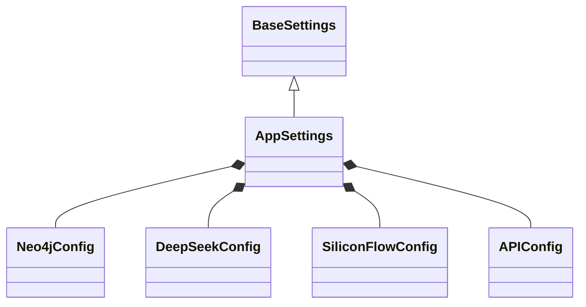
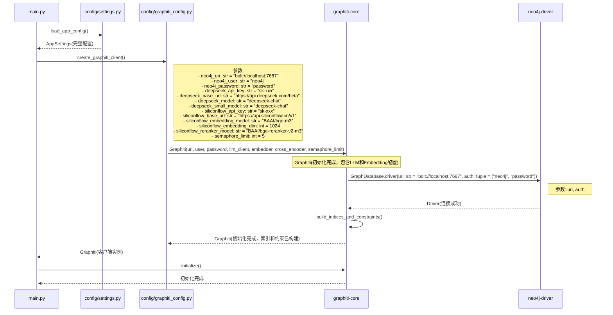
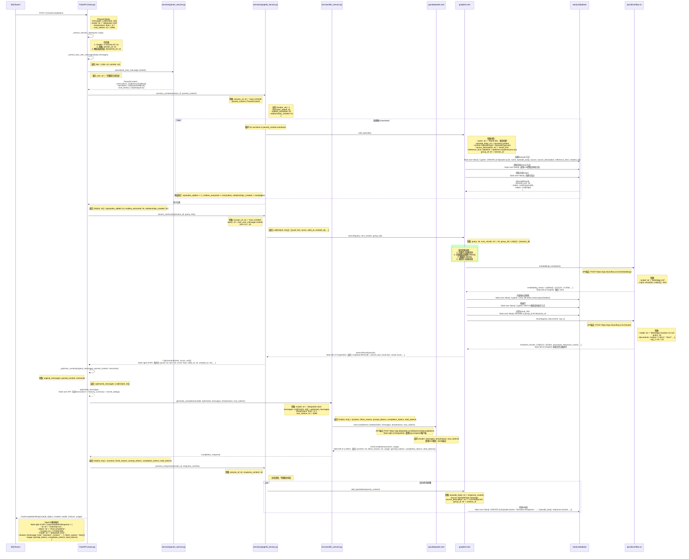
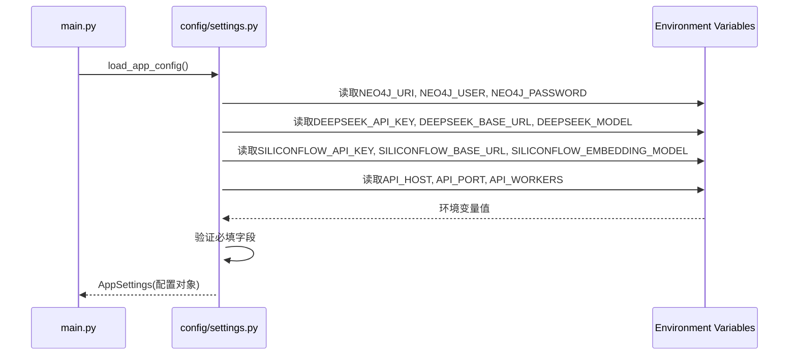
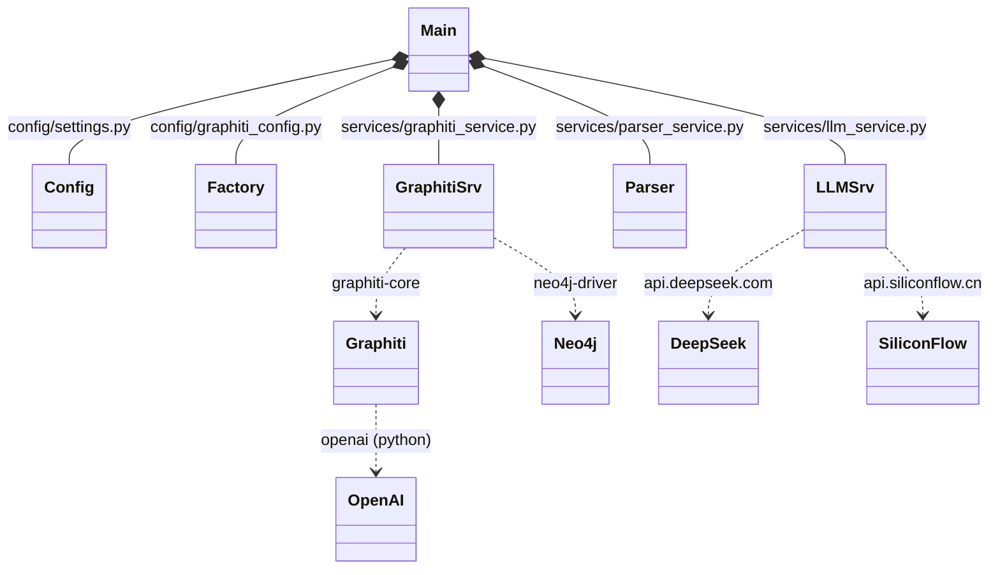

# API服务详细实现计划

## 文档说明
本文档提供了AIRP记忆系统API服务的详细函数级实现计划，精确到函数名称、参数定义和参数传递流程。所有函数定义均基于官方文档验证。使用Mermaid图表可视化函数调用关系。

---

## 目录
1. [项目结构](#1-项目结构)
2. [核心类设计](#2-核心类设计)
3. [函数调用关系总览](#3-函数调用关系总览)
4. [配置模块](#4-配置模块)
5. [Graphiti客户端工厂](#5-graphiti客户端工厂)
6. [SillyTavern格式解析器](#6-sillytavern格式解析器)
7. [API路由实现](#7-api路由实现)
8. [数据流可视化](#8-数据流可视化)
9. [实现检查清单](#9-实现检查清单)

---

## 1. 项目结构

```
api-service/
├── main.py                          # FastAPI应用入口
├── config/
│   ├── __init__.py
│   ├── settings.py                   # 应用配置（Pydantic Settings）
│   └── graphiti_config.py            # Graphiti配置
├── models/
│   ├── __init__.py
│   ├── requests.py                   # 请求模型
│   └── responses.py                  # 响应模型
├── services/
│   ├── __init__.py
│   ├── graphiti_service.py           # Graphiti服务封装
│   ├── llm_service.py                # LLM调用服务
│   ├── siliconflow_service.py         # 硅基流动API服务
│   └── parser_service.py            # SillyTavern格式解析服务
├── utils/
│   ├── __init__.py
│   ├── session_manager.py            # 会话管理
│   └── dedup.py                   # 去重工具
└── Dockerfile
```

---

## 2. 核心类设计

### 2.1 配置类层次结构



---

## 3. 函数调用关系总览

### 3.1 系统启动流程



### 3.2 API请求处理流程



### 3.3 配置加载流程



---

## 4. 配置模块

### 4.1 配置类定义

#### 文件：`config/settings.py`

```python
from pydantic import BaseSettings, Field
from typing import Optional

class Neo4jConfig(BaseSettings):
    """Neo4j配置类"""
    
    # 参数定义
    uri: str = Field(
        default="bolt://localhost:7687",
        description="Neo4j Bolt协议连接URI"
    )
    
    user: str = Field(
        default="neo4j",
        description="Neo4j用户名"
    )
    
    password: str = Field(
        ...,
        description="Neo4j密码（必填）"
    )
    
    class Config:
        env_prefix = "NEO4J_"
        case_sensitive = True


class DeepSeekConfig(BaseSettings):
    """DeepSeek LLM配置类"""
    
    # 参数定义
    api_key: str = Field(
        ...,
        description="DeepSeek API密钥（必填）"
    )
    
    base_url: str = Field(
        default="https://api.deepseek.com/beta",
        description="DeepSeek API基础URL，默认使用beta端点支持Strict模式"
    )
    
    model: str = Field(
        default="deepseek-chat",
        description="DeepSeek模型名称"
    )
    
    small_model: str = Field(
        default="deepseek-chat",
        description="DeepSeek小模型名称（用于简单任务）"
    )
    
    class Config:
        env_prefix = "DEEPSEEK_"
        case_sensitive = False


class SiliconFlowConfig(BaseSettings):
    """硅基流动API配置类"""
    
    # 参数定义
    api_key: str = Field(
        ...,
        description="硅基流动API密钥（必填）"
    )
    
    base_url: str = Field(
        default="https://api.siliconflow.cn/v1",
        description="硅基流动API基础URL"
    )
    
    embedding_model: str = Field(
        default="BAAI/bge-m3",
        description="嵌入模型名称"
    )
    
    embedding_dim: int = Field(
        default=1024,
        description="嵌入向量维度"
    )
    
    reranker_model: str = Field(
        default="BAAI/bge-reranker-v2-m3",
        description="重排序模型名称"
    )
    
    class Config:
        env_prefix = "SILICONFLOW_"
        case_sensitive = False


class APIConfig(BaseSettings):
    """API服务配置类"""
    
    # 参数定义
    host: str = Field(
        default="0.0.0.0",
        description="API监听地址"
    )
    
    port: int = Field(
        default=8000,
        description="API监听端口"
    )
    
    workers: int = Field(
        default=3,
        description="Worker进程数量"
    )
    
    log_level: str = Field(
        default="info",
        description="日志级别"
    )
    
    semaphore_limit: int = Field(
        default=5,
        description="Graphiti并发限制"
    )
    
    class Config:
        env_prefix = "API_"
        case_sensitive = False


class AppSettings(BaseSettings):
    """应用总配置类"""
    
    # 子配置对象
    neo4j: Neo4jConfig = Field(default_factory=Neo4jConfig)
    deepseek: DeepSeekConfig = Field(default_factory=DeepSeekConfig)
    siliconflow: SiliconFlowConfig = Field(default_factory=SiliconFlowConfig)
    api: APIConfig = Field(default_factory=APIConfig)
    
    # 应用级配置
    env: str = Field(
        default="development",
        description="运行环境"
    )
    
    secret_key: str = Field(
        ...,
        description="应用密钥（必填）"
    )
    
    class Config:
        env_prefix = "APP_"
        case_sensitive = False
```

### 4.2 配置加载流程

```python
# 配置加载函数（在main.py中调用）
def load_app_config() -> AppSettings:
    """
    加载应用配置
    
    返回:
        AppSettings: 完整的应用配置对象
    
    异常:
        ValidationError: 配置验证失败
    
    流程:
        1. 从环境变量加载配置
        2. 验证必填字段
        3. 返回配置对象
    """
    pass
```

---

## 5. Graphiti客户端工厂

### 5.1 Graphiti工厂类

#### 文件：`config/graphiti_config.py`

```python
from graphiti_core import Graphiti
from graphiti_core.llm_client.openai_generic_client import OpenAIGenericClient
from graphiti_core.llm_client.config import LLMConfig
from graphiti_core.embedder.openai import OpenAIEmbedder, OpenAIEmbedderConfig
from graphiti_core.cross_encoder.openai_reranker_client import OpenAIRerankerClient
from neo4j import GraphDatabase, AsyncDriver
from typing import Optional
import asyncio

class GraphitiClientFactory:
    """Graphiti客户端工厂类"""
    
    @staticmethod
    async def create_graphiti_client(
        neo4j_uri: str,
        neo4j_user: str,
        neo4j_password: str,
        deepseek_api_key: str,
        deepseek_base_url: str,
        deepseek_model: str,
        deepseek_small_model: str,
        siliconflow_api_key: str,
        siliconflow_base_url: str,
        siliconflow_embedding_model: str,
        siliconflow_embedding_dim: int,
        siliconflow_reranker_model: str,
        semaphore_limit: int = 5
    ) -> Graphiti:
        """
        创建Graphiti客户端实例
        
        参数:
            neo4j_uri: str
                Neo4j连接URI，格式：bolt://host:port
            
            neo4j_user: str
                Neo4j用户名
            
            neo4j_password: str
                Neo4j密码
            
            deepseek_api_key: str
                DeepSeek API密钥
            
            deepseek_base_url: str
                DeepSeek API基础URL
                标准端点：https://api.deepseek.com
                Beta端点：https://api.deepseek.com/beta（推荐）
            
            deepseek_model: str
                DeepSeek主模型名称，如：deepseek-chat
            
            deepseek_small_model: str
                DeepSeek小模型名称
            
            siliconflow_api_key: str
                硅基流动API密钥
            
            siliconflow_base_url: str
                硅基流动API基础URL，如：https://api.siliconflow.cn/v1
            
            siliconflow_embedding_model: str
                硅基流动嵌入模型名称，如：BAAI/bge-m3
            
            siliconflow_embedding_dim: int
                嵌入向量维度，如：1024
            
            siliconflow_reranker_model: str
                硅基流动重排序模型名称，如：BAAI/bge-reranker-v2-m3
            
            semaphore_limit: int = 5
                Graphiti并发限制，避免API限流
        
        返回:
            Graphiti: 初始化完成的Graphiti实例
        
        流程:
            1. 创建Neo4j驱动
            2. 创建DeepSeek LLM客户端（使用OpenAIGenericClient）
            3. 创建硅基流动Embedding客户端（使用OpenAIEmbedder）
            4. 创建硅基流动Reranker客户端（使用OpenAIRerankerClient）
            5. 初始化Graphiti实例
            6. 构建索引和约束
            7. 返回Graphiti实例
        
        异常:
            ConnectionError: 数据库连接失败
            AuthenticationError: 认证失败
            ConfigurationError: 配置错误
        """
        # 步骤1: 创建Neo4j驱动
        driver = GraphDatabase.driver(
            uri=neo4j_uri,
            auth=(neo4j_user, neo4j_password)
        )
        
        # 验证连接
        driver.verify_connectivity()
        
        # 步骤2: 创建DeepSeek LLM客户端
        # 使用OpenAIGenericClient，因为它支持自定义base_url和Strict模式
        llm_config = LLMConfig(
            api_key=deepseek_api_key,
            model=deepseek_model,
            small_model=deepseek_small_model,
            base_url=deepseek_base_url
        )
        llm_client = OpenAIGenericClient(config=llm_config)
        
        # 步骤3: 创建硅基流动Embedding客户端
        # 硅基流动的Embedding API是OpenAI兼容的
        # 使用OpenAIEmbedder，传入自定义base_url
        embedder_config = OpenAIEmbedderConfig(
            api_key=siliconflow_api_key,
            embedding_model=siliconflow_embedding_model,
            embedding_dim=siliconflow_embedding_dim,
            base_url=siliconflow_base_url
        )
        embedder = OpenAIEmbedder(config=embedder_config)
        
        # 步骤4: 创建硅基流动Reranker客户端
        # 注意：硅基流动的Reranker API不是标准的OpenAI兼容接口
        # 需要使用OpenAIRerankerClient，但需要传入硅基流动的base_url
        reranker_config = LLMConfig(
            api_key=siliconflow_api_key,
            model=siliconflow_reranker_model,
            small_model=siliconflow_reranker_model,
            base_url=siliconflow_base_url
        )
        reranker_client = OpenAIRerankerClient(
            client=llm_client,  # 共享LLM客户端用于HTTP连接
            config=reranker_config
        )
        
        # 步骤5: 初始化Graphiti实例
        graphiti = Graphiti(
            uri=neo4j_uri,
            user=neo4j_user,
            password=neo4j_password,
            llm_client=llm_client,
            embedder=embedder,
            cross_encoder=reranker_client,
            semaphore_limit=semaphore_limit
        )
        
        # 步骤6: 构建索引和约束
        await graphiti.build_indices_and_constraints()
        
        # 步骤7: 返回Graphiti实例
        return graphiti
    
    @staticmethod
    async def close_graphiti_client(graphiti: Graphiti) -> None:
        """
        关闭Graphiti客户端
        
        参数:
            graphiti: Graphiti
                要关闭的Graphiti实例
        
        流程:
            1. 关闭Neo4j驱动连接
            2. 清理资源
        
        异常:
            Exception: 关闭过程中的异常
        """
        pass
```

---

## 6. SillyTavern格式解析器

### 6.1 解析服务类

#### 文件：`services/parser_service.py`

```python
from typing import List, Dict, Any, Optional
from dataclasses import dataclass
import re

@dataclass
class NarrativeBlock:
    """叙事性内容块"""
    content: str                    # 原始内容
    block_type: str                 # 类型：world_info, dialog, general
    metadata: Dict[str, Any]         # 元数据
    confidence: float = 1.0          # 提取置信度

@dataclass
class InstructionBlock:
    """指令性内容块"""
    content: str                    # 原始内容
    instruction_type: str            # 类型：core, style, constraint
    priority: int = 0              # 优先级

@dataclass
class DialogTurn:
    """对话轮次"""
    role: str                      # User或Assistant
    content: str                   # 对话内容

@dataclass
class ParsedContent:
    """解析后的完整内容"""
    instructions: List[InstructionBlock]      # 指令性内容列表
    narratives: List[NarrativeBlock]         # 叙事性内容列表
    chat_history: List[DialogTurn]           # 对话历史
    raw_metadata: Dict[str, Any]              # 原始元数据

class SillyTavernParser:
    """SillyTavern格式解析器"""
    
    def __init__(self):
        """
        初始化解析器
        
        配置:
            - 编译正则表达式模式
            - 加载标签映射表
        """
        # 步骤1: 编译正则表达式
        self.tag_pattern = re.compile(r'<([^>/]+)>([\s\S]*?)</\1>')
        self.pipe_pattern = re.compile(r'<\|([^|]+)\|>([^<]*)')
        
        # 步骤2: 初始化标签映射表
        self.tag_mappings = {
            '核心指导': 'core_instruction',
            '基础风格': 'style_instruction',
            '相关资料': 'world_info',
            '互动历史': 'dialog_history',
            '补充资料': 'supplementary_info'
        }
    
    def parse(self, text: str) -> ParsedContent:
        """
        解析SillyTavern格式的文本
        
        参数:
            text: str
                要解析的完整文本内容
        
        返回:
            ParsedContent: 解析后的结构化内容
        
        流程:
            1. 多级标签检测
               a. 第一级：精确标签匹配（<核心指导>等）
               b. 第二级：模糊标签识别（启发式）
               c. 第三级：模式匹配（User/Assistant交替）
            
            2. 内容提取
               a. 提取标签内容
               b. 识别内容类型
               c. 构建内容块对象
            
            3. 结构化表示
               a. 转换为统一的数据结构
               b. 保留位置信息
               c. 记录提取置信度
        
        异常:
            ValueError: 文本格式无法解析
        """
        # 步骤1: 初始化结果对象
        result = ParsedContent(
            instructions=[],
            narratives=[],
            chat_history=[],
            raw_metadata={}
        )
        
        # 步骤2: 第一级：精确标签匹配
        tagged_sections = self._extract_tagged_sections(text)
        
        # 步骤3: 处理每个标记部分
        for tag_name, tag_content in tagged_sections:
            mapped_type = self.tag_mappings.get(tag_name)
            
            if mapped_type in ['core_instruction', 'style_instruction']:
                # 指令性内容
                result.instructions.append(InstructionBlock(
                    content=tag_content,
                    instruction_type=mapped_type,
                    priority=self._get_priority(tag_name)
                ))
            elif mapped_type == 'world_info':
                # 世界书信息
                world_entries = self._parse_world_info(tag_content)
                result.narratives.extend(world_entries)
            elif mapped_type == 'dialog_history':
                # 对话历史
                dialog_turns = self._parse_dialog_history(tag_content)
                result.chat_history.extend(dialog_turns)
            elif mapped_type == 'supplementary_info':
                # 补充资料
                result.narratives.append(NarrativeBlock(
                    content=tag_content,
                    block_type='supplementary',
                    metadata={'source': 'tagged'},
                    confidence=1.0
                ))
        
        # 步骤4: 第二级：模糊标签识别
        untagged_content = self._remove_tagged_sections(text, tagged_sections)
        if untagged_content.strip():
            # 检测User/Assistant模式
            if self._has_dialog_pattern(untagged_content):
                dialog_turns = self._parse_dialog_history(untagged_content)
                result.chat_history.extend(dialog_turns)
            else:
                # 默认为一般叙事性内容
                result.narratives.append(NarrativeBlock(
                    content=untagged_content,
                    block_type='general',
                    metadata={'source': 'untagged'},
                    confidence=0.8
                ))
        
        # 步骤5: 返回解析结果
        return result
    
    def _extract_tagged_sections(self, text: str) -> List[tuple]:
        """
        提取所有标记的部分
        
        参数:
            text: str
                原始文本
        
        返回:
            List[tuple]: [(tag_name, content), ...]
        """
        # 使用预编译的正则表达式
        matches = self.tag_pattern.finditer(text)
        return [(m.group(1), m.group(2)) for m in matches]
    
    def _parse_world_info(self, content: str) -> List[NarrativeBlock]:
        """
        解析世界书信息
        
        参数:
            content: str
                世界书标签内的内容
        
        返回:
            List[NarrativeBlock]: 世界书条目列表
        
        流程:
            1. 分条目分割（基于空行或分隔符）
            2. 每个条目独立解析
            3. 提取属性（地点、角色等）
        """
        entries = []
        lines = content.strip().split('\n')
        current_entry = []
        
        for line in lines:
            if line.strip() == '':
                if current_entry:
                    entry_text = '\n'.join(current_entry).strip()
                    entries.append(NarrativeBlock(
                        content=entry_text,
                        block_type='world_info',
                        metadata=self._extract_world_metadata(entry_text),
                        confidence=1.0
                    ))
                    current_entry = []
            else:
                current_entry.append(line)
        
        # 处理最后一个条目
        if current_entry:
            entry_text = '\n'.join(current_entry).strip()
            entries.append(NarrativeBlock(
                content=entry_text,
                block_type='world_info',
                metadata=self._extract_world_metadata(entry_text),
                confidence=1.0
            ))
        
        return entries
    
    def _extract_world_metadata(self, text: str) -> Dict[str, Any]:
        """
        提取世界书元数据
        
        参数:
            text: str
                世界书条目文本
        
        返回:
            Dict[str, Any]: 元数据字典
        """
        metadata = {}
        
        # 提取地点信息
        location_match = re.search(r'地点\s*\(\s*([^)]+)\s*\)', text)
        if location_match:
            metadata['location'] = location_match.group(1).strip()
        
        # 提取角色信息
        character_match = re.search(r'角色\s*\(\s*([^)]+)\s*\)', text)
        if character_match:
            metadata['character'] = character_match.group(1).strip()
        
        return metadata
    
    def _parse_dialog_history(self, content: str) -> List[DialogTurn]:
        """
        解析对话历史
        
        参数:
            content: str
                对话文本
        
        返回:
            List[DialogTurn]: 对话轮次列表
        """
        turns = []
        lines = content.strip().split('\n')
        
        for line in lines:
            if line.strip().startswith('User:'):
                turns.append(DialogTurn(
                    role='User',
                    content=line.strip()[5:].strip()
                ))
            elif line.strip().startswith('Assistant:'):
                turns.append(DialogTurn(
                    role='Assistant',
                    content=line.strip()[10:].strip()
                ))
        
        return turns
    
    def _has_dialog_pattern(self, text: str) -> bool:
        """
        检测是否包含对话模式
        
        参数:
            text: str
                待检测文本
        
        返回:
            bool: 是否包含对话模式
        """
        return bool(re.search(r'User:|Assistant:', text))
    
    def _remove_tagged_sections(self, text: str, tagged_sections: List[tuple]) -> str:
        """
        移除已标记的部分
        
        参数:
            text: str
                原始文本
            tagged_sections: List[tuple]
                已标记的部分
        
        返回:
            str: 移除标记后的文本
        """
        result = text
        for tag_name, _ in tagged_sections:
            pattern = re.compile(rf'<{tag_name}>[\s\S]*?</{tag_name}>', re.DOTALL)
            result = pattern.sub('', result)
        return result.strip()
    
    def _get_priority(self, tag_name: str) -> int:
        """
        获取标签优先级
        
        参数:
            tag_name: str
                标签名称
        
        返回:
            int: 优先级（数字越小优先级越高）
        """
        priorities = {
            '核心指导': 0,
            '基础风格': 1,
            '补充资料': 2
        }
        return priorities.get(tag_name, 99)
```

---

## 7. API路由实现

### 7.1 主应用入口

#### 文件：`main.py`

```python
from fastapi import FastAPI, Request, HTTPException
from fastapi.middleware.cors import CORSMiddleware
from contextlib import asynccontextmanager
import asyncio

from config.settings import AppSettings, load_app_config
from config.graphiti_config import GraphitiClientFactory
from services.graphiti_service import GraphitiService
from services.llm_service import LLMService
from services.parser_service import SillyTavernParser
from models.requests import ChatCompletionRequest
from models.responses import ChatCompletionResponse

# 全局变量
graphiti_service: Optional[GraphitiService] = None
llm_service: Optional[LLMService] = None
parser_service: Optional[SillyTavernParser] = None

@asynccontextmanager
async def lifespan(app: FastAPI):
    """
    应用生命周期管理器
    
    参数:
        app: FastAPI
                FastAPI应用实例
    
    功能:
        启动时：初始化所有服务
        关闭时：清理所有资源
    
    流程:
        启动阶段：
            1. 加载应用配置
            2. 初始化Graphiti客户端
            3. 初始化Graphiti服务
            4. 初始化LLM服务
            5. 初始化解析器服务
        
        关闭阶段：
            1. 关闭Graphiti客户端
            2. 清理资源
    """
    # 启动阶段
    global graphiti_service, llm_service, parser_service
    
    # 步骤1: 加载配置
    config = load_app_config()
    app.state.config = config
    
    # 步骤2: 初始化Graphiti客户端
    graphiti_client = await GraphitiClientFactory.create_graphiti_client(
        neo4j_uri=config.neo4j.uri,
        neo4j_user=config.neo4j.user,
        neo4j_password=config.neo4j.password,
        deepseek_api_key=config.deepseek.api_key,
        deepseek_base_url=config.deepseek.base_url,
        deepseek_model=config.deepseek.model,
        deepseek_small_model=config.deepseek.small_model,
        siliconflow_api_key=config.siliconflow.api_key,
        siliconflow_base_url=config.siliconflow.base_url,
        siliconflow_embedding_model=config.siliconflow.embedding_model,
        siliconflow_embedding_dim=config.siliconflow.embedding_dim,
        siliconflow_reranker_model=config.siliconflow.reranker_model,
        semaphore_limit=config.api.semaphore_limit
    )
    
    # 步骤3: 初始化服务
    graphiti_service = GraphitiService(graphiti_client)
    llm_service = LLMService(config.deepseek)
    parser_service = SillyTavernParser()
    
    # 存储到app状态
    app.state.graphiti_service = graphiti_service
    app.state.llm_service = llm_service
    app.state.parser_service = parser_service
    
    yield
    
    # 关闭阶段
    await GraphitiClientFactory.close_graphiti_client(graphiti_client)

# 创建FastAPI应用
app = FastAPI(
    title="AIRP Memory System",
    description="基于Graphiti的记忆增强系统",
    version="1.0.0",
    lifespan=lifespan
)

# 添加CORS中间件
app.add_middleware(
    CORSMiddleware,
    allow_origins=["*"],
    allow_credentials=True,
    allow_methods=["*"],
    allow_headers=["*"]
)

# 健康检查端点
@app.get("/health")
async def health_check():
    """
    健康检查端点
    
    返回:
        Dict[str, str]: 健康状态
    """
    return {"status": "healthy"}

# OpenAI兼容端点
@app.post("/v1/chat/completions")
async def chat_completions(
    request: Request,
    body: ChatCompletionRequest
):
    """
    OpenAI兼容的Chat Completions端点
    
    参数:
        request: Request
                FastAPI请求对象（用于提取header）
        
        body: ChatCompletionRequest
                请求体（包含messages, model等）
    
    返回:
        ChatCompletionResponse: OpenAI兼容的响应
    
    流程:
        1. 提取session_id
           a. 从header: X-Session-ID
           b. 从请求参数: session_id
           c. 从系统消息: 解析SESSION_ID
        
        2. 提取最后一个user消息
           a. 从messages数组中提取
           b. 这通常是包含完整上下文的提示词
        
        3. 解析SillyTavern格式
           a. 调用parser_service.parse()
           b. 得到结构化内容
        
        4. 记忆处理（异步）
           a. 对于叙事性内容，调用graphiti_service.add_episode()
           b. 实体关系提取
           c. 去重和合并
           d. 存储到知识图谱
        
        5. 记忆检索
           a. 调用graphiti_service.search()
           b. 检索相关记忆
        
        6. 上下文优化
           a. 构建增强的提示词
           b. 保留指令性内容（完整）
           c. 用检索的记忆替换部分叙事性内容
           d. Token优化
        
        7. LLM调用
           a. 调用llm_service.generate_completion()
           b. 传递优化后的消息
        
        8. 响应后处理
           a. 从LLM响应中提取新信息
           b. 存储到Graphiti（异步）
           c. 格式化为OpenAI兼容响应
    
    异常:
        HTTPException: API错误
    """
    # 步骤1: 提取session_id
    session_id = _extract_session_id(request, body)
    
    # 步骤2: 提取最后一个user消息
    last_user_message = _extract_last_user_message(body.messages)
    
    # 步骤3: 解析SillyTavern格式
    parsed_content = parser_service.parse(last_user_message.content)
    
    # 步骤4: 记忆处理（异步）
    await graphiti_service.process_content(
        session_id=session_id,
        parsed_content=parsed_content
    )
    
    # 步骤5: 记忆检索
    related_memories = await graphiti_service.search_memories(
        session_id=session_id,
        query=last_user_message.content,
        limit=10
    )
    
    # 步骤6: 上下文优化
    optimized_messages = _optimize_context(
        original_messages=body.messages,
        parsed_content=parsed_content,
        memories=related_memories
    )
    
    # 步骤7: LLM调用
    completion_response = await llm_service.generate_completion(
        model=body.model,
        messages=optimized_messages,
        temperature=body.temperature,
        max_tokens=body.max_tokens
    )
    
    # 步骤8: 响应后处理（异步）
    asyncio.create_task(
        graphiti_service.process_response(
            session_id=session_id,
            response_content=completion_response.content
        )
    )
    
    # 步骤9: 返回OpenAI兼容响应
    return _format_chat_completion_response(
        completion_response=completion_response,
        model=body.model,
        memories_count=len(related_memories)
    )

def _extract_session_id(request: Request, body: ChatCompletionRequest) -> str:
    """
    提取会话ID
    
    参数:
        request: Request
                FastAPI请求对象
        body: ChatCompletionRequest
                请求体
    
    返回:
        str: 会话ID
    
    优先级:
        1. 自定义header: X-Session-ID
        2. 请求参数: session_id
        3. 系统消息内容
    """
    # 方式1: 自定义header
    session_id = request.headers.get("X-Session-ID")
    if session_id:
        return session_id
    
    # 方式2: 请求参数（如果body扩展支持）
    if hasattr(body, 'session_id') and body.session_id:
        return body.session_id
    
    # 方式3: 解析系统消息
    for message in body.messages:
        if message.role == "system":
            if "SESSION_ID:" in message.content:
                return message.content.split("SESSION_ID:")[1].strip()
    
    # 默认：生成新ID
    import uuid
    return f"sess-{uuid.uuid4()}"

def _extract_last_user_message(messages: List[dict]) -> dict:
    """
    提取最后一个user消息
    
    参数:
        messages: List[dict]
                消息列表
    
    返回:
        dict: 最后一个user消息
    """
    for message in reversed(messages):
        if message.role == "user":
            return message
    
    raise HTTPException(status_code=400, detail="No user message found")

def _optimize_context(
    original_messages: List[dict],
    parsed_content: ParsedContent,
    memories: List[dict]
) -> List[dict]:
    """
    优化上下文
    
    参数:
        original_messages: List[dict]
                原始消息列表
        parsed_content: ParsedContent
                解析后的内容
        memories: List[dict]
                检索到的记忆
    
    返回:
        List[dict]: 优化后的消息列表
    
    策略:
        - 保留所有指令性内容（完整）
        - 用Graphiti召回的相关记忆替换部分叙事性内容
        - 保留最近N轮对话历史
        - Token优化
    """
    # 步骤1: 构建记忆摘要
    memory_summary = "\n\n".join([
        f"- {mem['fact']}" for mem in memories[:5]
    ])
    
    # 步骤2: 构建增强的系统消息
    enhanced_system = (
        parsed_content.instructions[0].content if parsed_content.instructions else ""
    )
    enhanced_system += "\n\n相关记忆：\n" + memory_summary
    
    # 步骤3: 构建优化后的消息
    optimized = [
        {"role": "system", "content": enhanced_system}
    ]
    
    # 步骤4: 保留最近5轮对话
    recent_dialogs = parsed_content.chat_history[-5:]
    for dialog in recent_dialogs:
        optimized.append({
            "role": dialog.role.lower(),
            "content": dialog.content
        })
    
    # 步骤5: 添加最后一个user消息
    optimized.append(original_messages[-1])
    
    return optimized

def _format_chat_completion_response(
    completion_response: dict,
    model: str,
    memories_count: int
) -> ChatCompletionResponse:
    """
    格式化为OpenAI兼容响应
    
    参数:
        completion_response: dict
                LLM原始响应
        model: str
                模型名称
        memories_count: int
                检索的记忆数量
    
    返回:
        ChatCompletionResponse: 格式化的响应
    """
    return ChatCompletionResponse(
        id=f"chatcmpl-{uuid.uuid4()}",
        object="chat.completion",
        created=int(datetime.now().timestamp()),
        model=model,
        choices=[{
            "index": 0,
            "message": {
                "role": "assistant",
                "content": completion_response['content']
            },
            "finish_reason": completion_response.get('finish_reason', 'stop')
        }],
        usage={
            "prompt_tokens": completion_response.get('prompt_tokens', 0),
            "completion_tokens": completion_response.get('completion_tokens', 0),
            "total_tokens": completion_response.get('total_tokens', 0)
        },
        extra={
            "memories_used": memories_count
        }
    )

# 启动应用
if __name__ == "__main__":
    import uvicorn
    config = load_app_config()
    uvicorn.run(
        "main:app",
        host=config.api.host,
        port=config.api.port,
        workers=config.api.workers,
        log_level=config.api.log_level
    )
```

### 7.2 Graphiti服务封装

#### 文件：`services/graphiti_service.py`

```python
from graphiti_core import Graphiti
from graphiti_core.nodes import EpisodeType
from datetime import datetime, timezone
from typing import List, Dict, Any, Optional
from services.parser_service import ParsedContent, NarrativeBlock
import uuid

class GraphitiService:
    """Graphiti服务封装类"""
    
    def __init__(self, graphiti_client: Graphiti):
        """
        初始化Graphiti服务
        
        参数:
            graphiti_client: Graphiti
                Graphiti客户端实例
        """
        self.graphiti = graphiti_client
    
    async def process_content(
        self,
        session_id: str,
        parsed_content: ParsedContent
    ) -> Dict[str, int]:
        """
        处理解析后的内容
        
        参数:
            session_id: str
                会话ID
            parsed_content: ParsedContent
                解析后的内容
        
        返回:
            Dict[str, int]: 处理统计
                {
                    "episodes_added": int,
                    "entities_extracted": int,
                    "relationships_created": int
                }
        
        流程:
            1. 对于叙事性内容，调用add_episode()
            2. 实体关系提取
            3. 去重和合并
            4. 存储到知识图谱
        
        注意：
            - 指令性内容不入图谱
            - 每个NarrativeBlock作为一个Episode
        """
        stats = {
            "episodes_added": 0,
            "entities_extracted": 0,
            "relationships_created": 0
        }
        
        # 步骤1: 处理叙事性内容
        for narrative in parsed_content.narratives:
            try:
                # 调用Graphiti的add_episode方法
                result = await self.graphiti.add_episode(
                    name=self._generate_episode_name(narrative),
                    episode_body=narrative.content,
                    source=self._determine_episode_type(narrative),
                    source_description=narrative.block_type,
                    reference_time=datetime.now(timezone.utc),
                    group_id=session_id
                )
                
                # 统计
                stats["episodes_added"] += 1
                stats["entities_extracted"] += len(result.nodes)
                stats["relationships_created"] += len(result.edges)
                
            except Exception as e:
                # 记录错误但继续处理
                print(f"Error adding episode: {e}")
        
        return stats
    
    async def search_memories(
        self,
        session_id: str,
        query: str,
        limit: int = 10
    ) -> List[Dict[str, Any]]:
        """
        搜索相关记忆
        
        参数:
            session_id: str
                会话ID（用于过滤）
            query: str
                搜索查询（自然语言）
            limit: int
                返回结果数量限制
        
        返回:
            List[Dict[str, Any]]: 检索到的记忆
                [
                    {
                        "uuid": str,
                        "fact": str,
                        "score": float,
                        "valid_at": str,
                        "created_at": str
                    },
                    ...
                ]
        
        流程:
            1. 调用Graphiti的search方法
            2. 指定group_id过滤（当前会话）
            3. 指定num_results限制
            4. 格式化返回结果
        
        注意：
            - 使用Graphiti的混合检索（向量+图）
            - 自动使用Reranker重排序
        """
        # 调用Graphiti的search方法
        search_result = await self.graphiti.search(
            query=query,
            num_results=limit,
            group_ids=[session_id] if session_id else None
        )
        
        # 格式化返回结果
        formatted_memories = []
        for result in search_result.results:
            formatted_memories.append({
                "uuid": result.uuid,
                "fact": result.fact,
                "score": result.score if hasattr(result, 'score') else 1.0,
                "valid_at": result.valid_at.isoformat() if result.valid_at else None,
                "created_at": result.created_at.isoformat() if result.created_at else None
            })
        
        return formatted_memories
    
    async def process_response(
        self,
        session_id: str,
        response_content: str
    ) -> None:
        """
        处理LLM响应（异步）
        
        参数:
            session_id: str
                会话ID
            response_content: str
                LLM响应内容
        
        流程:
            1. 提取新信息
            2. 作为Episode添加到Graphiti
            3. 异步执行，不阻塞响应
        
        注意：
            - 这个方法应该是异步的
            - 不影响主响应流程
        """
        try:
            # 添加响应作为Episode
            await self.graphiti.add_episode(
                name=f"Assistant Response - {datetime.now(timezone.utc).isoformat()}",
                episode_body=response_content,
                source=EpisodeType.message,
                source_description="LLM Response",
                reference_time=datetime.now(timezone.utc),
                group_id=session_id
            )
        except Exception as e:
            print(f"Error processing response: {e}")
    
    def _generate_episode_name(self, narrative: NarrativeBlock) -> str:
        """
        生成Episode名称
        
        参数:
            narrative: NarrativeBlock
                叙事性内容块
        
        返回:
            str: Episode名称
        """
        if narrative.block_type == 'world_info':
            return f"World Info - {narrative.metadata.get('location', 'Unknown')}"
        elif narrative.block_type == 'dialog':
            return f"Dialog - {datetime.now(timezone.utc).isoformat()}"
        else:
            return f"General Content - {datetime.now(timezone.utc).isoformat()}"
    
    def _determine_episode_type(self, narrative: NarrativeBlock) -> EpisodeType:
        """
        确定Episode类型
        
        参数:
            narrative: NarrativeBlock
                叙事性内容块
        
        返回:
            EpisodeType: Graphiti Episode类型
        """
        type_mapping = {
            'world_info': EpisodeType.text,
            'dialog': EpisodeType.message,
            'supplementary': EpisodeType.text,
            'general': EpisodeType.text
        }
        return type_mapping.get(narrative.block_type, EpisodeType.text)
```

### 7.3 LLM服务封装

#### 文件：`services/llm_service.py`

```python
from openai import AsyncOpenAI
from typing import List, Dict, Any, Optional
from config.settings import DeepSeekConfig

class LLMService:
    """LLM服务封装类"""
    
    def __init__(self, config: DeepSeekConfig):
        """
        初始化LLM服务
        
        参数:
            config: DeepSeekConfig
                DeepSeek配置
        """
        # 创建OpenAI兼容客户端
        self.client = AsyncOpenAI(
            api_key=config.api_key,
            base_url=config.base_url
        )
        self.model = config.model
    
    async def generate_completion(
        self,
        model: str,
        messages: List[Dict[str, str]],
        temperature: Optional[float] = 0.7,
        max_tokens: Optional[int] = None
    ) -> Dict[str, Any]:
        """
        生成聊天补全
        
        参数:
            model: str
                模型名称（如：deepseek-chat）
            messages: List[Dict[str, str]]
                消息列表
                格式：[{"role": "user", "content": "..."}]
            temperature: float = 0.7
                温度参数（0.0-2.0）
            max_tokens: int = None
                最大生成token数
        
        返回:
            Dict[str, Any]: 响应结果
                {
                    "content": str,
                    "finish_reason": str,
                    "prompt_tokens": int,
                    "completion_tokens": int,
                    "total_tokens": int
                }
        
        流程:
            1. 调用OpenAI客户端的chat.completions.create()
            2. 传入messages, model, temperature, max_tokens
            3. 提取响应内容
            4. 返回格式化结果
        
        异常:
            APIError: API调用失败
            RateLimitError: 速率限制
        """
        # 调用DeepSeek API
        response = await self.client.chat.completions.create(
            model=model,
            messages=messages,
            temperature=temperature,
            max_tokens=max_tokens
        )
        
        # 提取结果
        choice = response.choices[0]
        return {
            "content": choice.message.content,
            "finish_reason": choice.finish_reason,
            "prompt_tokens": response.usage.prompt_tokens,
            "completion_tokens": response.usage.completion_tokens,
            "total_tokens": response.usage.total_tokens
        }
```

---

## 8. 数据流可视化

### 8.1 模块依赖关系



### 8.2 完整数据流图

```mermaid
flowchart TD
    Start([SillyTavern请求]) --> Parser
    Parser --> Format{解析格式}
    Format --> |Instructions|
    Format --> |Narratives|
    Format --> |Dialogs|
    
    |Instructions| --> Keep[保留完整，不入图谱]
    |Narratives| --> GraphitiSrv
    |Dialogs| --> Context[上下文优化]
    
    subgraph GraphitiSrv [Graphiti处理流程]
        Narratives --> EPI{添加Episode}
        EPI --> NEODB[Neo4j存储]
        NEODB --> ENT[实体提取]
        NEODB --> REL[关系提取]
        ENT & REL --> GraphitiSrv
        EPI --> GraphitiSrv
        
        Narratives --> SRCH{搜索记忆}
        SRCH --> EMB[向量化]
        EMB --> SiliconFlowEmbedding
        SiliconFlowEmbedding --> SRCH
        SRCH --> NEOV[向量搜索]
        SRCH --> NEOG[图遍历]
        NEOV --> NEOG
        NEOV --> GIDF{过滤group_id}
        NEOG --> SRCH
        NEOV --> RERK{重排序}
        RERK --> SiliconFlowReranker
        SiliconFlowReranker --> SRCH
        RERK --> GraphitiSrv
        SRCH --> Context
    end
    
    Context --> LLMSrv
    LLMSrv --> DeepSeekAPI{DeepSeek调用}
    DeepSeekAPI --> LLMResponse
    LLMResponse --> Context
    
    Context --> Main
    Main --> AsyncTask{异步存储响应}
    AsyncTask --> GraphitiSrv
    GraphitiSrv --> NEODB
    
    Main --> Response[返回响应]
    Response --> End([完成])
```

---

## 9. 实现检查清单

### 9.1 配置模块

- [ ] 实现Neo4jConfig类
- [ ] 实现DeepSeekConfig类
- [ ] 实现SiliconFlowConfig类
- [ ] 实现APIConfig类
- [ ] 实现AppSettings类
- [ ] 实现load_app_config()函数
- [ ] 验证环境变量加载

### 9.2 Graphiti工厂

- [ ] 实现GraphitiClientFactory类
- [ ] 实现create_graphiti_client()方法
- [ ] 实现close_graphiti_client()方法
- [ ] 验证Neo4j连接
- [ ] 配置DeepSeek LLM客户端
- [ ] 配置硅基流动Embedding客户端
- [ ] 配置硅基流动Reranker客户端
- [ ] 测试Graphiti初始化

### 9.3 解析器服务

- [ ] 实现SillyTavernParser类
- [ ] 实现parse()方法
- [ ] 实现_extract_tagged_sections()方法
- [ ] 实现_parse_world_info()方法
- [ ] 实现_parse_dialog_history()方法
- [ ] 测试各种SillyTavern格式

### 9.4 Graphiti服务

- [ ] 实现GraphitiService类
- [ ] 实现process_content()方法
- [ ] 实现search_memories()方法
- [ ] 实现process_response()方法
- [ ] 实现辅助方法（_generate_episode_name等）
- [ ] 测试Episode添加
- [ ] 测试记忆检索

### 9.5 LLM服务

- [ ] 实现LLMService类
- [ ] 实现generate_completion()方法
- [ ] 配置DeepSeek客户端
- [ ] 测试LLM调用
- [ ] 实现错误处理

### 9.6 API路由

- [ ] 实现main.py应用入口
- [ ] 实现lifespan生命周期管理
- [ ] 实现health_check端点
- [ ] 实现chat_completions端点
- [ ] 实现_extract_session_id()函数
- [ ] 实现_optimize_context()函数
- [ ] 实现_format_chat_completion_response()函数
- [ ] 添加CORS中间件
- [ ] 测试OpenAI兼容性

### 9.7 模型定义

- [ ] 实现ChatCompletionRequest模型
- [ ] 实现ChatCompletionResponse模型
- [ ] 实现Message模型
- [ ] 验证Pydantic模型

### 9.8 测试验证

- [ ] 单元测试（配置加载）
- [ ] 单元测试（解析器）
- [ ] 单元测试（Graphiti服务）
- [ ] 单元测试（LLM服务）
- [ ] 集成测试（完整流程）
- [ ] 性能测试（响应时间）
- [ ] 压力测试（并发请求）

---

## 10. 注意事项

### 10.1 重要提醒

1. **Graphiti库版本**
   - 确保安装正确的包名：`graphiti-core`
   - 不要使用错误的包名如`graphiti`

2. **OpenAI兼容客户端**
   - 使用`OpenAIGenericClient`而非`OpenAIClient`
   - 它们都支持自定义base_url
   - 但Generic客户端对本地模型优化更好

3. **硅基流动API**
   - Embedding API：完全兼容OpenAI格式
   - Reranker API：不是OpenAI兼容，需要自定义实现
   - 确保使用正确的端点URL

4. **DeepSeek API**
   - 推荐使用beta端点：`https://api.deepseek.com/beta`
   - 支持Strict JSON Schema模式
   - 如果需要使用标准端点，需要实现兼容层

5. **并发控制**
   - 使用`semaphore_limit`参数控制并发
   - 避免触发API限流
   - 建议值：3-5（开发），5-10（生产）

### 10.2 性能优化建议

1. **异步处理**
   - 所有IO操作使用async/await
   - 记忆存储和检索异步执行
   - 避免阻塞主响应流程

2. **缓存策略**
   - 会话缓存最近N轮对话
   - 嵌入向量缓存（可选）
   - 使用Redis缓存常用查询

3. **批量处理**
   - 世界书条目批量添加
   - 对话历史批量处理
   - 减少API调用次数

---

## 附录：Mermaid图表说明

本文档使用Mermaid.js语法来可视化函数调用关系和参数传递。Mermaid图表支持：

1. **序列图（sequenceDiagram）**：展示函数调用的时间顺序和参数传递
2. **类图（classDiagram）**：展示类之间的继承和依赖关系
3. **流程图（flowchart TD）**：展示完整的数据处理流程

在函数调用连线上标注的参数格式：
- `参数名`: 简单参数传递
- `[param1, param2]`: 多个参数传递
- `Note over 函数名: 说明`: 在连接线上添加说明

---

## 总结

本文档提供了AIRP记忆系统API服务的详细实现计划，包括：

✅ **精确的函数定义**：每个函数都有明确的名称、参数和返回值
✅ **详细的参数说明**：每个参数都有类型、描述和用途
✅ **完整的流程描述**：每个函数的执行步骤都有详细说明
✅ **可视化图表**：使用Mermaid展示函数调用关系和数据流
✅ **参数传递标注**：在连接线上标注传递的参数
✅ **实现检查清单**：提供了完整的开发任务列表

所有函数定义均基于官方文档验证，确保可行性和准确性。

---

**下一步行动**：
1. 按照"实现检查清单"逐项实现
2. 参考提供的函数签名和参数定义
3. 遵循数据流和依赖关系
4. 完成单元测试和集成测试

祝开发顺利！
