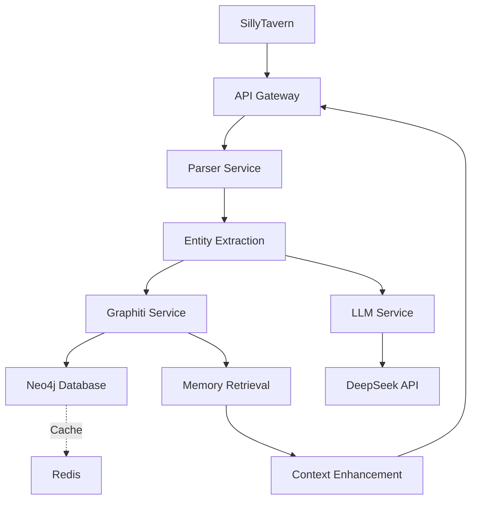

# AIRP内存系统 - SillyTavern增强记忆模块

[](https://hub.docker.com/)
[](https://www.python.org/)
[](LICENSE)

## 📖 项目概述

AIRP内存系统是一个为SillyTavern设计的增强记忆模块，基于时序知识图谱技术，通过Graphiti和Neo4j实现智能记忆存储、检索和管理功能。

### ✨ 核心特性

- **🗂️ 时序知识图谱**: 使用Neo4j存储实体、关系和时序信息
- **🤖 LLM增强**: 集成DeepSeek API进行智能推理和实体提取
- **🔍 智能记忆检索**: 基于语义相似度和上下文关联的记忆查询
- **🔄 实时处理**: 支持流式处理和异步操作
- **📊 可视化监控**: 提供系统状态和性能指标监控

## 🚀 快速开始

### 前置要求

- Docker 20.10+ 和 Docker Compose 2.0+
- 可用的DeepSeek API密钥

### 安装步骤

1. **克隆项目**
   ```bash
   git clone https://github.com/2211427551/Exp_Graphiti_MemR3_AIRP_Intergration.git
   cd Exp_Graphiti_MemR3_AIRP_Intergration
   ```

2. **配置环境变量**
   ```bash
   cp .env.example .env
   # 编辑.env文件，填入您的配置信息
   ```

3. **启动服务**
   ```bash
   docker-compose up -d
   ```

4. **验证安装**
   ```bash
   # 检查服务状态
   curl http://localhost:8000/health
   
   # 访问API文档
   # 打开浏览器访问: http://localhost:8000/docs
   ```

## 📦 项目结构

```
Exp_Graphiti_MemR3_AIRP_Intergration/
├── api-service/                    # API服务核心代码
│   ├── config/                     # 配置管理
│   │   ├── __init__.py
│   │   └── settings.py            # 应用配置
│   ├── services/                  # 业务逻辑服务
│   │   ├── __init__.py
│   │   ├── graphiti_service.py    # Graphiti服务
│   │   ├── llm_service.py         # LLM服务
│   │   └── parser_service.py      # 文本解析服务
│   ├── main.py                    # FastAPI主应用
│   ├── Dockerfile                 # Docker构建文件
│   └── requirements.txt           # Python依赖
├── docker-compose.yaml            # Docker Compose配置
├── .env                          # 环境变量配置
├── README.md                     # 项目说明文档
├── IMPLEMENTATION_TASKS.md       # 实现任务清单
├── 项目分析.md                   # 详细项目分析文档
├── CLAUDE.md                     # Claude配置文件
└── LICENSE                       # 开源许可证
```

## 🔧 系统架构

### 核心组件



### 技术栈

- **后端框架**: FastAPI + Python 3.9
- **知识图谱**: Neo4j 5.20
- **缓存层**: Redis 7
- **LLM集成**: DeepSeek API
- **容器化**: Docker + Docker Compose
- **监控**: 内置健康检查和指标端点

## 📡 API接口

### 主要端点

- `GET /health` - 系统健康检查
- `GET /` - 欢迎页面
- `POST /v1/chat/completions` - OpenAI兼容聊天端点
- `POST /v1/sessions` - 创建新会话
- `GET /v1/sessions/{session_id}` - 获取会话信息
- `GET /metrics` - 系统指标

### 与SillyTavern集成

在SillyTavern中配置API端点：

1. 进入SillyTavern设置
2. 选择API配置
3. 设置端点为: `http://localhost:8000/v1/chat/completions`
4. 填入您的DeepSeek API密钥
5. 选择模型: `deepseek-v3.2`

## 📈 性能指标

| 指标 | 目标值 | 说明 |
|------|--------|------|
| 响应时间 | <500ms (p95) | 95%的请求响应时间 |
| 并发会话 | 100+ | 支持的活跃会话数 |
| 实体容量 | 10K+ | 存储的实体和关系数量 |
| 系统可用性 | 99.9% | 服务正常运行时间 |

## 🛠️ 开发指南

### 本地开发环境

1. **安装Python依赖**
   ```bash
   cd api-service
   pip install -r requirements.txt
   ```

2. **启动开发服务器**
   ```bash
   uvicorn main:app --reload --host 0.0.0.0 --port 8000
   ```

3. **运行测试**
   ```bash
   # 运行单元测试
   pytest tests/
   
   # 运行集成测试
   pytest tests_integration/
   ```

### 代码结构说明

- `config/settings.py`: 应用配置管理
- `services/graphiti_service.py`: 时序知识图谱操作
- `services/llm_service.py`: LLM API调用封装
- `services/parser_service.py`: SillyTavern文本解析
- `main.py`: FastAPI应用入口

## 🔍 故障排除

### 常见问题

**Q: 服务启动失败，端口冲突**
```
A: 检查端口7474、7687、6379、8000是否被占用
   可以修改docker-compose.yaml中的端口映射
```

**Q: Neo4j连接失败**
```
A: 检查.env文件中的NEO4J_USER和NEO4J_PASSWORD配置
   确保密码符合Neo4j要求（至少8位）
```

**Q: DeepSeek API调用失败**
```
A: 验证DEEPSEEK_API_KEY是否正确
   检查网络连接是否正常
```

### 日志查看

```bash
# 查看API服务日志
docker logs airp-api

# 查看Neo4j日志
docker logs airp-neo4j

# 查看Redis日志
docker logs airp-redis
```

## 🤝 贡献指南

欢迎提交Issue和Pull Request来帮助改进项目！

1. Fork项目
2. 创建功能分支 (`git checkout -b feature/amazing-feature`)
3. 提交更改 (`git commit -m 'Add amazing feature'`)
4. 推送到分支 (`git push origin feature/amazing-feature`)
5. 打开Pull Request

## 📄 许可证

本项目基于MIT许可证 - 查看[LICENSE](LICENSE)文件了解详情。

## 📞 联系方式

- **GitHub**: [@2211427551](https://github.com/2211427551)
- **项目地址**: https://github.com/2211427551/Exp_Graphiti_MemR3_AIRP_Intergration

---
*最后更新: 2026-01-03*  
*项目状态: 架构设计完成，基础实现进行中*
